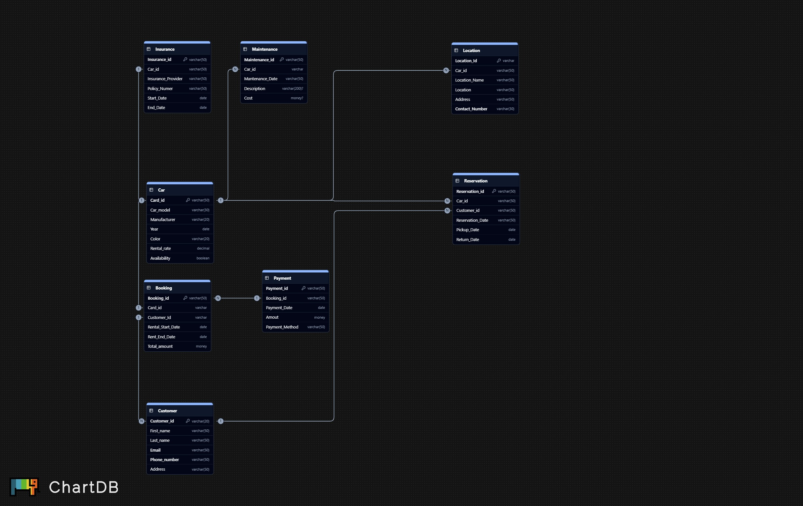

# Car Rental Management System (SQL Server Project)

## Overview

This project implements a **Car Rental Management System** using  **Microsoft SQL Server** , based on an  **Entity-Relationship Diagram (ERD)** .

It demonstrates database design, table creation, and the execution of **CRUD (Create, Read, Update, Delete)** operations for managing a car rental business.

---

## ER Diagram

The system is designed around the following key entities:

* **Car**
* **Customer**
* **Booking**
* **Payment**
* **Reservation**
* **Insurance**
* **Maintenance**
* **Location**

Each table is linked using **Primary Keys** and **Foreign Keys** to maintain  **referential integrity** .

---

## Database Schema

**Relationships Summary:**

* Each **Car** can have multiple  **Bookings** ,  **Reservations** ,  **Insurances** ,  **Maintenance records** , and a  **Location** .
* Each **Customer** can have multiple **Bookings** and  **Reservations** .
* Each **Booking** is linked to one  **Payment** .

---

## Table Creation

The database consists of eight tables:

| Table Name      | Description                                            |
| --------------- | ------------------------------------------------------ |
| `Car`         | Stores vehicle details, availability, and rental rates |
| `Customer`    | Stores customer personal details                       |
| `Booking`     | Records car booking information                        |
| `Payment`     | Tracks payments for bookings                           |
| `Reservation` | Manages car reservation details                        |
| `Insurance`   | Contains car insurance details                         |
| `Maintenance` | Stores maintenance and service records                 |
| `Location`    | Tracks car storage and pickup locations                |

All tables were created using SQL `CREATE TABLE` statements with appropriate data types, constraints, and foreign keys.

---

## CRUD Operations

### Create

Each table is populated with **five rows** of dummy data using `INSERT INTO` statements.

Example:

<pre class="overflow-visible!" data-start="1973" data-end="2115">

<code class="whitespace-pre! language-sql">INSERTINTO Car VALUES
('C001', 'Corolla', 'Toyota', 2020, 'White', 55.00, 1),
('C002', 'Civic', 'Honda', 2021, 'Black', 60.00, 1);
</code>

</pre>

---

### Read

Various `SELECT` queries are used to retrieve and join data from multiple tables.

Examples:

<pre class="overflow-visible!" data-start="2227" data-end="2513">

<code class="whitespace-pre! language-sql">-- Get all available cars
SELECT*FROM Car WHERE Availability =1;

-- View all bookings with customer names
SELECT B.Booking_id, C.First_name, C.Last_name, B.Rental_Start_Date, B.Rent_End_Date, B.Total_Amount
FROM Booking B
JOIN Customer C ON B.Customer_id = C.Customer_id;
</code>

</pre>

---

### Update

Records can be modified using `UPDATE` queries.

Example:

<pre class="overflow-visible!" data-start="2592" data-end="2660">

<code class="whitespace-pre! language-sql">UPDATE Car SET Rental_rate =65.00WHERE Car_id ='C002';
</code>

</pre>

---

### Delete

Specific records can be removed using `DELETE` queries.

Example:

<pre class="overflow-visible!" data-start="2746" data-end="2811">

<code class="whitespace-pre! language-sql">DELETEFROM Reservation WHERE Reservation_id ='R005';
</code>

</pre>

---

## Key Features

✅ Relational database with well-defined constraints

✅ Normalized structure to prevent data redundancy

✅ Demonstration of all CRUD operations

✅ Includes relationships between multiple entities

✅ Easy to extend (e.g., adding employee or fleet management tables)

---

## Tools & Technologies

| Tool                                          | Purpose                           |
| --------------------------------------------- | --------------------------------- |
| **Microsoft SQL Server**                | Database engine                   |
| **SQL Server Management Studio (SSMS)** | Query execution & database design |
| **ChartDB**                             | ER Diagram design                 |
| **T-SQL**                               | Database query language           |

---

## How to Run the Project

1. Open  **SQL Server Management Studio (SSMS)** .
2. Create a new database:
   <pre class="overflow-visible!" data-start="3495" data-end="3560">

<code class="whitespace-pre! language-sql">CREATE DATABASE CarRentalDB;
   USE CarRentalDB;
   </code>

</pre>
3. Copy and execute the `CREATE TABLE` statements.
4. Insert the sample data using `INSERT` queries.
5. Run the `SELECT`, `UPDATE`, and `DELETE` queries to test functionality.

---

## Project Structure

<pre class="overflow-visible!" data-start="3771" data-end="4075">

<code class="whitespace-pre!">CarRentalManagement/
│
├── ER_Diagram.jpeg               # Visual representation of the database
├── CarRentalDB.sql               # SQL script with all queries
├── README.md                     # Project documentation (this file)
└── /data                         # (Optional) CSV or backup data
</code>

</pre>

---

## Example Use Case

A customer visits a rental branch to book a car.

1. The **Customer** record is stored.
2. A **Reservation** is created for the desired  **Car** .
3. Once confirmed, a **Booking** and **Payment** are recorded.
4. The  **Car** 's **Availability** updates automatically to unavailable.
5. Any **Maintenance** or **Insurance** data can also be tracked for that vehicle.

---

## Author

Follow me 

